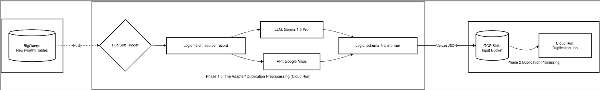

# Duplication Preprocessing Adapter (Phase 1.5)

## 1. Overview
The **Duplication Preprocessing Adapter** is a stateless Cloud Run microservice acting as the technical "Glue" and "Enrichment Engine" between **Extraction** and **Duplication**.

Beyond simple field mapping, this service utilizes **Generative AI (Gemini)** and **Google Maps API** to ensure every lead has high-fidelity descriptions and precise spatial coordinates before entering the duplication check.

---
## 2. Migration Plan & Flow Logic
The system follows an asynchronous **Event-Pull** pattern to ensure the duplication script always works with the most accurate, geocoded data committed to the database.



1.  **Commit**: Records are saved to `projects_newsworthy`, `event_newsworthy`, or `expansion_area_newsworthy`.
2.  **Notify**: Pub/Sub carries the `document_id` and `category` to the Adapter.
3.  **Fetch**: The Adapter pulls the raw record from BigQuery.
4.  **Enrich (Intelligence Layer)**: 
    * **LLM Call**: If description or property counts are missing/thin, the Adapter calls Gemini to research the project.
    * **Geocoding**: If coordinates are missing, it calls Google Maps API or falls back to Municipality Centroids.
5.  **Transform**: Data is mapped to legacy JSON format.
6.  **Handoff**: Final JSON is saved to GCS, triggering the Duplication Process Cloud Run.

---

## 3. Adapter Technical Blueprint: Intelligence & Logic

### Core Functions & Responsibilities
| Function Component | Task | Technical Detail |
| :--- | :--- | :--- |
| **`fetch_source_record`** | Data Retrieval | Executes a parameterized `SELECT` from BQ using `source_id`. |
| **`fill_blanks_with_ai`** | **LLM Enrichment** | Calls **Gemini-1.5-Pro** to refine project names, descriptions, and property counts via web search grounding. |
| **`handle_location`** | **Coordinate Sync** | Attempts **Google Maps Geocoding** for specific addresses; falls back to **Centroid Lookups** for general municipalities. |
| **`filter_logic`** | Validation | Executes `is_about_refugees` (AZC) and `extract_houses` (minimum 6 units) checks. |
| **`schema_transformer`** | Compatibility | Maps new keys to legacy keys (e.g., `unit_count` → `number_of_properties`). |
| **`gcs_sink_finalizer`** | Trigger Handoff | Uploads JSON to `gs://newsradar/project_duplicate_check_input/{id}.json` and invokes the next Cloud Run Job. |


## 4. Operational Excellence

### Intelligence & Filtering (Quality Gate)
- **AI-Driven Enrichment**: Triggered only if `source_type` is not from a high-quality source (like Nieuwbouw.nl) or if `has_valid_location` is false.
- **Project Scale**: Skips non-tender/non-housing projects with fewer than 6 units.
- **Content Filtering**: Uses regex patterns to identify and skip Asylum Seeker Centers (AZC).

### Resilience & Error Handling
- **Dead Letter Queue (DLQ)**: Failed transformations/API timeouts route to `topic-duplication-dlq` after 5 retries.
- **Safety Net**: An hourly reconciliation query identifies leads that finished post-processing but failed to enter the duplication stage.
- **Acknowledge Management**: The Adapter only ACKs the Pub/Sub message *after* the GCS upload and the next-stage trigger are confirmed.

---

## 5. Deployment & Configuration
The service requires access to **Secret Manager** for API keys (`GEMINI_API_KEY`, `Maps_API_KEY`).

```bash
gcloud run deploy duplication-adapter \
  --image gcr.io/houzr-280014/duplication-adapter \
  --region europe-west4 \
  --set-env-vars ENVIRONMENT=production,TARGET_BUCKET=newsradar 
```

## 5. Deployment Strategy

```bash
# Deploying the Adapter to Cloud Run
gcloud run deploy duplication-adapter \
  --image gcr.io/houzr-280014/duplication-adapter \
  --region europe-west4 \
  --set-env-vars ENVIRONMENT=production,TARGET_BUCKET=newsradar
```
# Migration Plan: Dataflow to Serverless Cloud Run

This document outlines the strategic transition from the legacy monolithic Apache Beam (Dataflow) pipeline to the new event-driven, microservices-based Cloud Run pipeline.

## Executive Summary
* **Legacy:** Dataflow (Java/Python Beam) - Batch/Streaming, high cold-start cost, complex maintenance.
* **Target:** Cloud Run (Python/Flask/AsyncIO) - Reactive, pay-per-use, sub-second scaling, decoupled stages.

---

## Phase 1: Infrastructure & Environment Setup
Before initiating data flow, the following environment must be "frozen" and verified.

- [ ] **Service Account (SA):** Create `news-pipeline-sa` with the IAM roles specified in `README.md`.
- [ ] **Storage Buckets:** Initialize the four-tier bucket system (`raw`, `extracted`, `enriched`, `status`).
- [ ] **Secret Management:** Move API keys (Vertex AI/Maps) from hardcoded configs to GCP Secret Manager.
- [ ] **Baseline Snapshot:** Take a final export of the current BigQuery production tables for parity comparison.

---

## Phase 2: Shadow Execution (Dual-Run)
*Goal: Run both pipelines in parallel to verify data integrity without affecting production.*

1. **Scraper Forking:** Modify the upstream Scraper to upload PDFs to **both** the legacy bucket and the new `gs://raw_pdf_ingest`.
2. **Shadow Sink:** Direct the Cloud Run pipeline to a **Shadow Dataset** (`[PROJECT]:poc_binod`).
3. **Monitoring:** * Compare processing time per document (Target: < 60s).
    * Compare AI extraction accuracy (Field-by-field parity check).
    * Monitor "Point-in-Polygon" rejection rates.

---

## Phase 3: Gradual Cutover (Canary)
*Goal: Shift a percentage of traffic to the new pipeline.*

- [ ] **Step 1:** Disable Dataflow for a low-volume municipality/source.
- [ ] **Step 2:** Observe the `document_pipeline_staging` table for 24 hours.
- [ ] **Step 3:** Validate that the "Merger Job" is successfully promoting staging data to production.
- [ ] **Step 4:** Scale to 50%, then 100% of municipal sources.

---

## Phase 4: Decommissioning & Cleanup
Once 100% parity is confirmed over a 7-day window:

1. **Stop Dataflow Jobs:** Cancel all remaining streaming or batch Dataflow jobs.
2. **Bucket Redirection:** Point all scraper uploads exclusively to the new `raw_pdf_ingest` bucket.
3. **IAM Cleanup:** Revoke legacy permissions used by Dataflow workers (e.g., Worker roles).
4. **Archive Code:** Move the legacy Beam codebase to an `archive/` branch in Git.

---

## Rollback Plan
In the event of a critical failure (e.g., Geocoding API limits reached, BQ merge conflicts):

1. **Immediate Action:** Disable Eventarc triggers via `gcloud eventarc triggers delete [TRIGGER_NAME]`.
2. **Resume Legacy:** Re-deploy the Dataflow template using the stored JAR/Python package in GCS.
3. **Data Recovery:** The original PDFs remain in `gs://raw_pdf_ingest` and can be re-processed by Dataflow by moving them back to the legacy source bucket.

---

## Success Metrics
| Metric | Success Threshold |
| :--- | :--- |
| **Latency** | End-to-end processing < 2 minutes |
| **Accuracy** | > 98% parity with legacy extraction |
| **Uptime** | 99.9% (Eventarc/Cloud Run availability) |